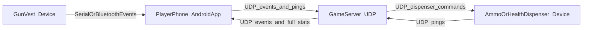

# LaserTag Game Description (Technical)

This document describes the gameplay and networking behavior implemented by:

- **Server**: `lasertag-server` (Spring Boot / Java)
- **Player client**: `lasertag-android` (Android app, per-player phone)

It is derived from the current code and reflects what the running system actually does.

## High-level architecture

The system is built around **stateless UDP** for real-time gameplay and a small amount of game state stored on the server.

## Player hardware configuration

Each player’s “client” is a small hardware stack controlled by the Android phone:

- **Phone (Android app)** connects via **Bluetooth** to the player’s **vest ESP32**.
- The **vest ESP32** is connected via a **UART coiled wire** to a second **ESP32 in the gun**.

Capabilities assumed for the wearable hardware:

- **RGB LEDs on vest + gun**: indicate player/game state (offline/idle/in-game/dead), team color, ammo/health cues, etc.
- **IR receive on vest + gun**:
  - can receive IR “hit” signals from another player’s gun
  - can receive IR signals from **respawn points** and **dispensers**
- **IR emit on gun**:
  - gun emits IR when firing a shot
- **Reload on gun**:
  - gun can trigger a reload action (magazine reload) which the phone tracks and reflects to the device state

In the current software split:

- The **phone app** is responsible for translating hardware events into UDP messages for the server, applying some local validation (friendly-fire, ammo checks, respawn-point validation), and driving device state (e.g., LEDs) via messages back to the vest.

## Game modes

Server enum: `net.lasertag.lasertagserver.core.GameType`

- **DM**: Individual deathmatch (winner is the top-scoring player).
- **TEAM_DM**: Team deathmatch (winner is the top-scoring team).
- **CTF**: Capture the Flag (team-based; flag events increment team score).

## Core gameplay loop (server)

Primary implementation: `net.lasertag.lasertagserver.core.Game`

### Lifecycle and state

The server tracks:

- `isGamePlaying` (boolean)
- `timeLeftSeconds` (countdown)

State transitions:

- **Start game**: `eventConsoleStartGame(timeMinutes, fragLimit, gameType)`
  - Applies settings (time limit, frag limit, game type)
  - Resets team scores
  - For each player:
    - `score = 0`
    - `health = 0` (player is considered “not alive” until respawned by device flow)
    - `flagCarrier = false`
    - assigns a respawn point ID
  - `isGamePlaying = true`
  - Broadcasts a **FULL_STATS snapshot** to all online players
  - Sends `GAME_START` to each online player

- **Game time**: `updateGameTime()` runs every second while playing
  - Decrements `timeLeftSeconds`
  - Ends the game when it reaches 0

- **End game**: `eventConsoleEndGame()`
  - `isGamePlaying = false`
  - Computes winner:
    - **team play**: winning team id (or `-1` on tie)
    - **solo**: winning player id (or `-1` on tie/no leader)
  - After ~1s delay, sends `GAME_OVER` to all players with the winner id

### Combat and scoring

All player gameplay events arrive via UDP and are handled in:

- `Game.onMessageFromPlayer(Player player, Messaging.MessageFromClient message)`

Key behaviors:

- **Hit / Kill**
  - The server updates the sender’s `Player.health` from the incoming packet field (`message.getHealth()`).
  - If message is `YOU_KILLED`:
    - The “killer” (resolved from `extraValue`) gets `+1` score.
    - In `TEAM_DM`, the killer’s team score is incremented.
    - The victim gets a new random respawn point assignment.
    - In `CTF`, if victim was carrying the flag: they drop it (`FLAG_LOST` broadcast).
    - If score or team score reaches `fragLimit`, the game ends.
  - If message is `GOT_HIT`:
    - The server tells the hitter that they hit someone by sending `YOU_HIT_SOMEONE` to `hitByPlayer` with payload `victimId`.

- **Flag (CTF)**
  - `FLAG_TAKEN`: marks player as `flagCarrier=true`, broadcasts `FLAG_TAKEN` with payload `playerId`.
  - `FLAG_CAPTURED`:
    - increments the capturing player’s team score
    - clears `flagCarrier`
    - broadcasts `FLAG_CAPTURED` with payload `playerId`
    - ends game on `fragLimit` reached by team score

- **Health/Ammo dispensers**
  - Client sends `GOT_HEALTH` or `GOT_AMMO` with `extraValue = dispenserId`.
  - Server responds:
    - sends `DISPENSER_USED` to the dispenser
    - sends `GIVE_HEALTH_TO_PLAYER(amount)` or `GIVE_AMMO_TO_PLAYER(amount)` to the player

### Snapshot updates

After most gameplay events, the server broadcasts a **FULL_STATS** snapshot to all online players.

Notably:

- After `GOT_HEALTH` / `GOT_AMMO`, a full snapshot is *not* sent immediately by `Game` (likely to reduce traffic); other events do trigger it.

## Actors and identity (server)

Implementation:

- `net.lasertag.lasertagserver.core.ActorRegistry`
- `net.lasertag.lasertagserver.model.Actor`, `Player`, `Dispenser`

There are fixed actor counts in code:

- Players: `ActorRegistry.PLAYER_COUNT = 6` with IDs `0..5`
- Dispensers: 4 ammo + 4 health (IDs `0..3` per type)

An actor is considered **online** when it has a remembered `clientIp`:

- `Actor.isOnline() == (clientIp != null)`

Respawn points:

- `RESPAWN_POINT_COUNT = PLAYER_COUNT`
- Server assigns an `assignedRespawnPoint` per player (shuffled at game start; random reassignment on death).

## UDP networking

Server implementation: `net.lasertag.lasertagserver.core.UdpServer`

Ports:

- **Server listens on**: UDP `9878`
- **Devices/phones listen on**: UDP `1234` (server sends packets to this port)

### Presence and timeouts

The server is ping-driven:

- Every received packet updates `lastPingTime[actor] = now`
- A scheduled loop (`checkConnectedClients`) marks the actor offline if no ping/event is received for ~10 seconds

### Ping messages (client → server)

Ping message types are grouped in `Messaging.PING_GROUP`:

- `PLAYER_PING` (41)
- `HEALTH_DISPENSER_PING` (45)
- `AMMO_DISPENSER_PING` (46)

Ping packet layout (3 bytes):

| Byte | Name | Description |
|---:|---|---|
| 0 | `typeId` | one of 41/45/46 |
| 1 | `actorId` | player or dispenser id |
| 2 | `firstEverMessage` | `0/1` (used to force (re)connect logic) |

Server response to any ping:

- Sends `PING` (1) to the sender’s stored `clientIp` on port 1234.

### Gameplay events (client → server)

Non-ping packet layout (4 bytes), parsed by `net.lasertag.lasertagserver.model.Messaging.MessageFromClient`:

| Byte | Name | Description |
|---:|---|---|
| 0 | `typeId` | event id |
| 1 | `actorId` | player id |
| 2 | `extraValue` | meaning depends on event (e.g., other player id, dispenser id) |
| 3 | `health` | sender’s current health as perceived by device/app |

### Server events (server → client)

Server-to-client messages are sent as:

- `bytes[0] = typeId`
- `bytes[1..] = payload` (0+ bytes depending on message)

In code this is built with `net.lasertag.lasertagserver.model.Messaging.eventToBytes(type, payload...)`.

Common payload shapes used by the current server implementation:

| Message | Direction | Payload bytes | Notes |
|---|---|---:|---|
| `PING` (1) | server → client | 0 | ACK for any ping in the ping group |
| `GAME_START` (8) | server → player | 2 | `[gameTypeOrdinal, timeLimitMinutes]` |
| `GAME_OVER` (7) | server → player | 1 | `[winnerId]` where winner is playerId or teamId; `-1` on tie/unknown |
| `YOU_HIT_SOMEONE` (4) | server → player | 1 | `[victimPlayerId]` |
| `YOU_SCORED` (10) | server → player | 1 | `[victimPlayerId]` (Android ignores payload; server uses it for informational purposes) |
| `GIVE_HEALTH_TO_PLAYER` (26) | server → player | 1 | `[amount]` |
| `GIVE_AMMO_TO_PLAYER` (27) | server → player | 1 | `[amount]` |
| `DISPENSER_USED` (51) | server → dispenser | 0 | “You were used”; dispenser-side firmware can enforce cooldown |
| `DISPENSER_SET_TIMEOUT` (53) | server → dispenser | 1 | `[timeoutPacked]` where `timeoutSeconds = timeoutPacked * 10` |
| `FLAG_LOST` (20) | server → players | 1 | `[playerId]` (flag carrier killed) |
| `FLAG_TAKEN` (19) | server → players | 1 | `[playerId]` |
| `FLAG_CAPTURED` (21) | server → players | 1 | `[playerId]` |

### FULL_STATS snapshot (server → client)

Type: `FULL_STATS` (11)

The server periodically broadcasts a full snapshot to all online players via `UdpServer.sendStatsToAll(...)`.

Encoding details (server: `net.lasertag.lasertagserver.model.Messaging.playerStatsToBytes(...)`):

- **Byte order**: LITTLE_ENDIAN
- **Header layout**:

| Field | Type | Bytes | Notes |
|---|---|---:|---|
| `type` | byte | 1 | `FULL_STATS` (11) |
| `gameRunning` | byte | 1 | `1/0` |
| `gameTypeOrdinal` | byte | 1 | `0=DM`, `1=TEAM_DM`, `2=CTF` |
| `timeSeconds` | short | 2 | remaining time |
| `playerCount` | byte | 1 | fixed 6 today, but encoded as a count |

- **Per-player record** (repeated `playerCount` times):

| Field | Type | Bytes |
|---|---|---:|
| `id` | byte | 1 |
| `health` | byte | 1 |
| `score` | byte | 1 |
| `teamId` | byte | 1 |
| `damage` | byte | 1 |
| `bulletsMax` | byte | 1 |
| `assignedRespawnPoint` | byte | 1 |
| `flagCarrier` | byte | 1 (`1/0`) |
| `nameLength` | byte | 1 |
| `nameBytes` | bytes | `nameLength` (only when `includeNames=true`) |

Android parsing note:

- The Android client (`net.lasertag.model.Messaging.parseFullStatsMessage`) interprets the 3rd header byte as **teamPlay** boolean.
- With the current server encoding, this effectively becomes:
  - DM (`0`) → `teamPlay=false`
  - TEAM_DM (`1`) → `teamPlay=true`
  - CTF (`2`) → `teamPlay=true`

So the phone UI can show “team play” vs “solo”, but it does not distinguish TEAM_DM vs CTF from the snapshot alone.

### Configuration pushed to actors (server)

Player parameters are applied from `GameSettingsPreset` into runtime `Player` objects via:

- `GameSettings.syncToActors()`

This sets (per player):

- `name`
- `bulletsMax`
- `damage`
- `teamId`

Dispenser settings:

- The server stores `timeout` and `amount` per dispenser type (ammo/health).
- Currently, the *only* setting actively pushed over UDP is:
  - `DISPENSER_SET_TIMEOUT` with `timeoutPacked = timeoutSeconds / 10`

## Android player phone app (client) behavior

Primary implementation:

- UDP networking: `net.lasertag.communication.UdpClient`
- Game orchestration: `net.lasertag.GameService`

### Client state machine (phone)

`GameService` maintains a small state machine (sent to the wearable/device and used by the UI):

- `STATE_OFFLINE`: no server connection (UDP heartbeat timeout)
- `STATE_IDLE`: connected but game not running
- `STATE_GAME`: game running and player alive
- `STATE_DEAD`: game running but player dead (waiting for respawn)

State is re-evaluated whenever new server data arrives and also when local events change health/alive status.

### UDP connectivity and heartbeat (phone ↔ server)

The phone app sends a heartbeat ping every `HEARTBEAT_INTERVAL` ms:

- Packet: `[PLAYER_REPLY_PING(41), playerId, firstEverMessageFlag]`
- Target: `SERVER_PORT` (9878) using either configured server IP or broadcast

The phone listens on UDP port `1234` and marks the server discovered/online upon receiving packets.

### Device (gun/vest) integration

The phone app receives device events and sends device state updates:

- Device → phone events (examples):
  - `GUN_SHOT`, `GUN_RELOAD`
  - `GOT_HIT` (payload: other player id)
  - `GOT_HEALTH`, `GOT_AMMO` (payload: dispenser id)
  - `RESPAWN` (payload: respawn point id)

- Phone → device state updates:
  - `DEVICE_PLAYER_STATE` containing:
    - player id
    - team id
    - current UI/game state (offline/idle/game/dead)
    - bullets left in magazine

### Local validation before sending to server

`GameService.handleEventFromDevice(...)` performs important client-side checks:

- **Shooting**:
  - If bullets in magazine > 0, player alive, and game running → decrements bullets locally and plays shot sound.
  - Otherwise → converts to `GUN_NO_BULLETS` locally and does *not* send a shot to the server.

- **Friendly fire prevention**:
  - On `GOT_HIT`, it looks up the other player from the last snapshot and suppresses damage if in team play and same team.

- **Health/ammo pickup suppression**:
  - If at max health / max bullets, or player is dead → does not propagate pickup to server.

- **Respawn point validation**:
  - The device sends `RESPAWN(extraValue=respawnPointId)`.
  - If it does not match the server-assigned respawn point in the latest snapshot, the phone does not send `RESPAWN` to server and instead emits `RESPAWN_POINT_WRONG` locally.

### How server snapshots drive the phone UI

When the phone receives `FULL_STATS` (Android name: `PLAYER_VALUES_SNAPSHOT`):

- It updates:
  - `isGameRunning`
  - `teamPlay` (derived as described above)
  - game timer (seconds)
  - all players list + this player’s own stats (health, score, team, damage, bulletsMax, respawn point)
- It sorts players by score for the on-device leaderboard.

## Message type reference (server IDs)

Server message IDs are defined in: `net.lasertag.lasertagserver.model.MessageType`

The most important ones for gameplay:

- **Connectivity**: `PING(1)`, `PLAYER_PING(41)`, `HEALTH_DISPENSER_PING(45)`, `AMMO_DISPENSER_PING(46)`
- **Game control**: `GAME_START(8)`, `GAME_OVER(7)`, `FULL_STATS(11)`
- **Combat**: `GOT_HIT(5)`, `YOU_HIT_SOMEONE(4)`, `YOU_SCORED(10)`, `YOU_KILLED(9)`
- **Respawn**: `RESPAWN(6)`
- **Dispensers**: `GOT_HEALTH(16)`, `GOT_AMMO(17)`, `GIVE_HEALTH_TO_PLAYER(26)`, `GIVE_AMMO_TO_PLAYER(27)`, `DISPENSER_USED(51)`, `DISPENSER_SET_TIMEOUT(53)`
- **CTF**: `FLAG_TAKEN(19)`, `FLAG_LOST(20)`, `FLAG_CAPTURED(21)`

